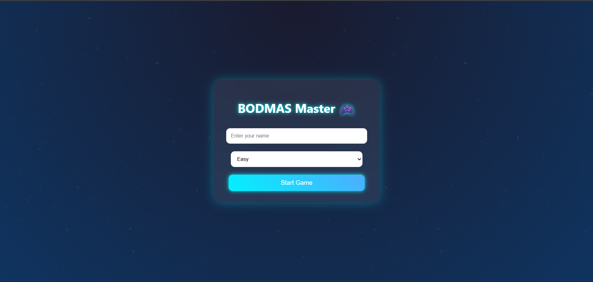
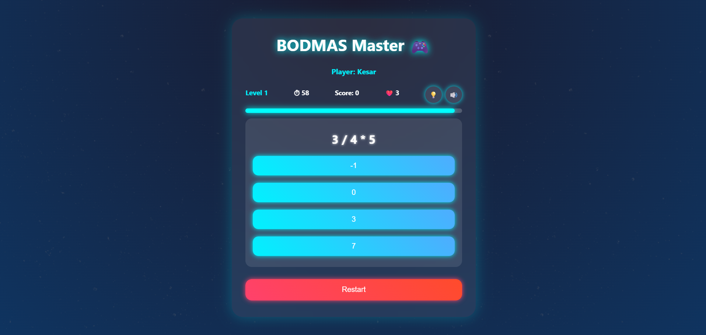
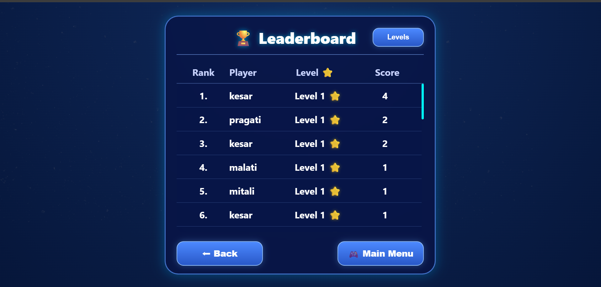

 # 🎮 BODMAS Master Game

An interactive math-based game built using **HTML, CSS, JavaScript, PHP, and MySQL** that helps users practice BODMAS rules in a fun and engaging way.

---

## 🚀 Features

- 🎯 Multiple Levels (Easy → Hard)
- 🧠 Random BODMAS Questions Generator
- ⏱ Countdown Timer
- ❤️ Lives System
- 💡 Hint System
- 🔊 Sound Toggle
- 🎉 Confetti Animation on Correct Answer
- ⭐ Star Rating System
- 🏆 Leaderboard (Top Scores)
- 👤 Player-wise Progress (Each name has separate levels)

---

## 🛠 Tech Stack

- **Frontend:** HTML, CSS, JavaScript  
- **Backend:** PHP  
- **Database:** MySQL  
- **Libraries:** Canvas Confetti  

---
  
# 🏗 System Architecture

The project follows a simple interactive architecture:

 User Interface (HTML / CSS)                      
                   ↓                                  
 Game Logic (JavaScript)           
                   ↓                               
 Backend (PHP)           
                   ↓       
Database (MySQL)

---

# 📂 Project Structure

📁 bodmas-game                                                                                                  
│                                                                                                                  
├── index.php                                                                                           
├── style.css                                                                                                
├── script.js                                                                                           
├── db.php                                                                                                       
├── save_score.php                                                                                                        
├── save_star.php                                                                                                                               
└── leaderboard.php                                                                                                                           
                                                                                               
--- 

## ⚙️ How to Run

1. Install XAMPP / WAMP
2. Move project folder to:

   htdocs/

3. Start:
- Apache
- MySQL

4. Open browser:

http://localhost/bodmas-master/

---

## 🎮 How to Play

1. Enter your name
2. Select difficulty
3. Choose level
4. Solve BODMAS questions
5. Earn stars ⭐
6. Unlock new levels
7. Check leaderboard 🏆

---

# 📸 Screenshots
Game Start Screen

Game Play

Leaderboard

 
 ## 💡 Future Improvements

- 🥇 Top 3 Leaderboard Highlight (Gold/Silver/Bronze)
- 📊 Player Statistics Dashboard
- 📱 Mobile App Version
- 🌐 Online Multiplayer Mode
- 🧠 Advanced BODMAS Challenges

---

## ⭐ Support

If you like this project, please ⭐ the repository!

---

## 👩‍💻 Author

**Kesar Karale**
 Regal College of Technology & Management 
 SNDT University
---
 
